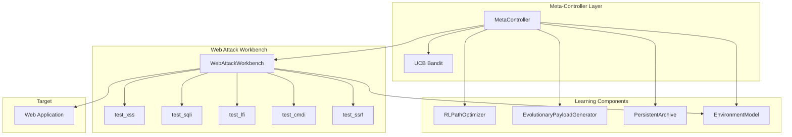

# RMLW Architecture

## Overview

The Recursive Meta-Learning Workbench (RMLW) has two main layers:

1. **Web Attack Workbench** – Static foundation for vulnerability testing
2. **Recursive Meta-Learning Layer** – Self-improving orchestration on top

## Component Diagram



## ASCII Diagram

```
┌─────────────────────────────────────────────────────────────────┐
│                     Meta-Controller (UCB Bandit)                  │
│  Mechanisms: M1=RL | M2=Evolution | M3=Archive | M4=Baseline    │
└─────────────────────────────────────────────────────────────────┘
                                    │
        ┌───────────────────────────┼───────────────────────────┐
        ▼                           ▼                           ▼
┌───────────────┐         ┌─────────────────┐         ┌──────────────┐
│ RLPathOptimizer│         │ EvolutionaryPayload│       │ PersistentArchive│
│ (Q-learning)   │         │ Generator          │       │ (successes)   │
└───────────────┘         └─────────────────┘         └──────────────┘
        │                           │                           │
        └───────────────────────────┼───────────────────────────┘
                                    ▼
                    ┌───────────────────────────────┐
                    │     EnvironmentModel          │
                    │  WAF | filters | successes    │
                    └───────────────────────────────┘
                                    │
                                    ▼
                    ┌───────────────────────────────┐
                    │     Web Attack Workbench       │
                    │  XSS | SQLi | LFI | CMDi | SSRF│
                    └───────────────────────────────┘
                                    │
                                    ▼
                    ┌───────────────────────────────┐
                    │     Target Web Application    │
                    └───────────────────────────────┘
```

## URL Utilities

The `url_utils` module enforces scope and validates targets:

- `validate_target_url`: Rejects disallowed schemes (file, javascript, data, etc.)
- `normalize_url`: Structural normalization for safe use
- `url_in_scope`: Ensures endpoints match the configured host

All scans are restricted to the host of the configured base URL.

## Web Attack Workbench

### Data Model

- **Endpoint**: `(method, url, params, headers, body)` – represents an HTTP endpoint
- **Parameter**: `(name, location, baseline_value)` – query, path, header, or body
- **Finding**: `(ftype, url, param, payload, detail)` – candidate vulnerability with evidence

### Test Functions

| Test | Signal | Heuristic |
|------|--------|-----------|
| XSS | Payload reflection | Payload appears in response body |
| SQLi | Boolean logic | True/false conditions produce different responses |
| LFI | File content | `/etc/passwd` markers in response |
| CMDi | Timing | `sleep N` causes measurable delay |
| SSRF | Internal access | Non-error response to internal IP probes |

### Parameter Selection

For each endpoint, parameters are extracted from the query string. All
present parameters are tested. For URLs without query params, a default
"q" is used. Body and header parameters are not yet supported.

### Discovery

- **Current**: Stub that seeds endpoints from configuration
- **Future**: Crawler, proxy import (Burp/ZAP), OpenAPI, GraphQL introspection

## Learning Layer

### EnvironmentModel

Captures target characteristics:

- `waf_detected`: WAF presence from headers
- `input_filtering`: Per-parameter filter behaviour
- `successful_payloads`: Payloads that triggered findings
- `failed_payloads`: Payloads that did not

### RLPathOptimizer

- **State**: Coarse encoding from EnvironmentModel
- **Actions**: Test families (xss, sqli, lfi, cmdi, ssrf)
- **Algorithm**: Tabular Q-learning

### EvolutionaryPayloadGenerator

- **Population**: Payload strings
- **Fitness**: Based on findings
- **Operators**: Mutation (encoding, case, quotes), crossover

### PersistentArchive

- Stores successful payloads with context
- Supports `recent(n)` and diversity retrieval
- Feeds recombination and novelty search

### MetaController

- **UCB Bandit**: Chooses which mechanism to apply
- **Strategies**: RL-driven, evolution, archive, baseline
- **Reward**: New findings, novelty

## Data Flow

1. MetaController selects mechanism (UCB)
2. Mechanism influences Workbench (payloads, test order)
3. Workbench runs tests against target
4. Findings update EnvironmentModel and Archive
5. RL/Evolution update based on reward
6. Repeat

## Future Extensions

- **LLM Integration**: Payload and strategy generation (stub interfaces exist)
- **Fisher-Rao Merging**: Combine specialised agents (documented in roadmap)
- **Richer Discovery**: Proxy import, JS analysis, GraphQL
